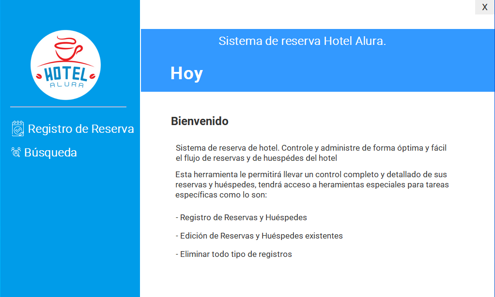

# Hotel-Alura

El menú principal de nuestra aplicación es nuestra presentación, podemos ver que contiene diferentes elementos:
* Imagen de wallpaper y logo del Hotel
* Botón Login que al ser clickado debe llevar a la ventana de iniciar sesión
* Botón salir que debe preguntar al usuario si realmente desea salir de la aplicación.

Esta ventana permitir al usuario ingresar su usuario y contraseña.
* Confirma al usuario cualquier error con la autenticacion.
  

  

En esta ventana se presenta las opciones cuando el usuario autenticado está dentro del sistema, tienes las siguientes opciones:

* Reservar: lleva a la ventana de Reservas
* Búsqueda: lleva a la ventana de Sistema de búsqueda.
* Salir del Sistema: lleva a la ventana de Login

Ademas de que siempre presenta la fecha del dia actual al operador.

<video src="2023-09-20%2010-33-46.mp4" controls title="Reservación"></video>

La ventana de Reservas debe permitir al usuário registrar los siguientes datos:

* Día de Entrada, Día de Salida
* Valor de la reserva, que será calculado en base a un valor de diaria fijo que tú mismo podrás elegir.

<video src="2023-09-20%2010-34-52.mp4" controls title="Huesped"></video>

En esta ventana colocamos los datos del huesped para terminar con la reservación. 

<video src="2023-09-20%2010-36-29.mp4" controls title="Busqueda"></video>

Esta es la ventana mas dinamica, aqui realizamos todas las operaciones de busqueda, edición y eliminación de datos.

podemos buscar por apellido y Id de la reservacion.

### Lista de recursos
* hibernate
* Lombok
* jcalendar-1.4
* Mysql
* NeatBeans Apache y VSCODE

# Gracias. James R.